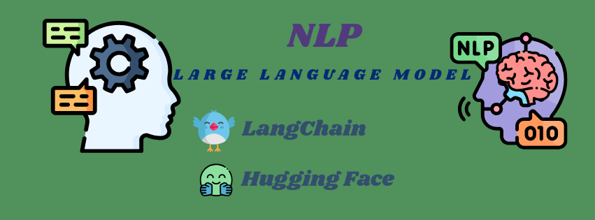
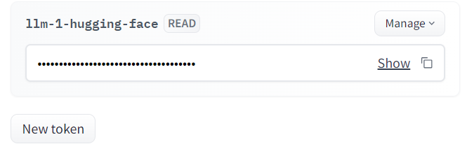
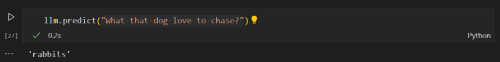
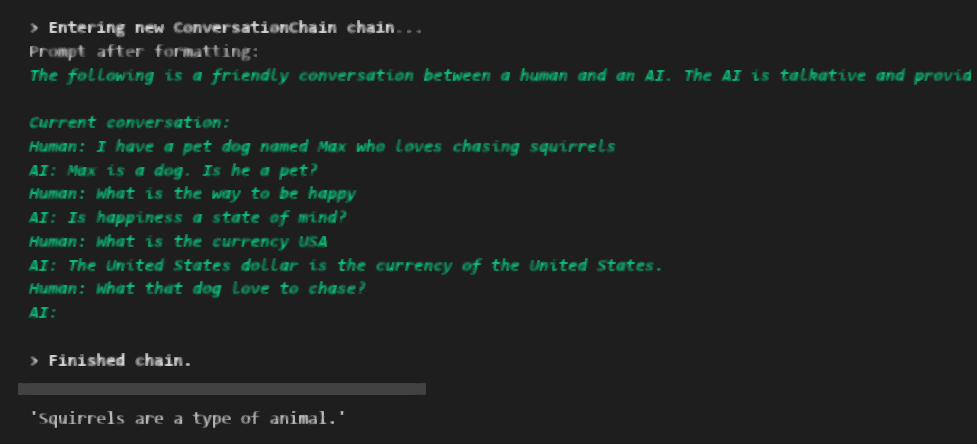

# 🌞 Virual Environment

### Create Virtual Environment in Powershell

"""sh 
    python -m venv env_llm 
"""

### Active Virtual Environment in Powershell

"""sh 
    .\env_llm\Scripts\activate
"""

🌳 Large Language Model Project
LLM (Large Language Models) are advanced AI models capable of processing and generating text at a large scale using deep learning techniques.

1. Langchain

        '''
            https://www.langchain.com/
        '''
   Github Repo

        '''
            https://github.com/langchain-ai/langchain
        '''
2. 
-- Install Langchain with huggingface_hub
note: huggingface requires to connect the langchain with LLM model

1. Hugging Face
   
        '''
            https://huggingface.co/
        '''
    Choose **Pretrained Model** For Text2Text Generation.

        '''
            https://huggingface.co/models
        '''
    >> hugging face login >> Top Right Corner >> settings >> access tokens (generate)
    
    📌Note: We can run the model locally after download but it is computationally expensive. 😃 But we can use it by calling the respective API of Hugging Face and run it over internet using access token.

### ⛳Topics 

    a. Impact of Text Generation Based on Temperature
    b. Prompt Template
    👉 Handle a single prompt template
    ref:https://python.langchain.com/docs/modules/model_io/prompts/prompt_templates/
    c. Few Shot Prompt
    👉allow multiple prompts reply for each output against each input / statement in a single run.
    ref: https://python.langchain.com/docs/modules/model_io/prompts/prompt_templates/few_shot_examples
    d. Save and Load Prompt in **`.json`** format 👇
    
        '''
            few_shot_prompt.json
        '''
    e. 🐬 Memory
        ref: https://python.langchain.com/docs/modules/memory/

-Conversation Buffer Memory: 
     ref: https://python.langchain.com/docs/modules/memory/types/buffer
        
        `provides us context of ongoing conversation by temporary storing last few conversation`.

🐉 Without Memory:

🐛 With Memory:

-ConversationBufferWindowMemory
ref: https://python.langchain.com/docs/modules/memory/types/buffer_window

-ConversationTokenBuffer
ref: https://python.langchain.com/docs/modules/memory/types/token_buffer

😤 **error:** ImportError: Could not import transformers python package. 

**solution:** ! pip install transformers

-ConversationSummaryBufferMemory
ref: https://python.langchain.com/docs/modules/memory/types/summary_buffer

**Key Note:** Add context in memory without doing the conversation

    memory.save_context({
        
        "input" : "Write a story for animal lover?"},
                    
                    {"output" : f"{story}"})

## Authors

- [@LinkedIn Khan MD Shibli Nomani](https://www.linkedin.com/in/khan-md-shibli-nomani-45445612b/)

🌝 Special courtesy and thanks to - [@Nurul Akter Towhid](https://github.com/Towhid1)
